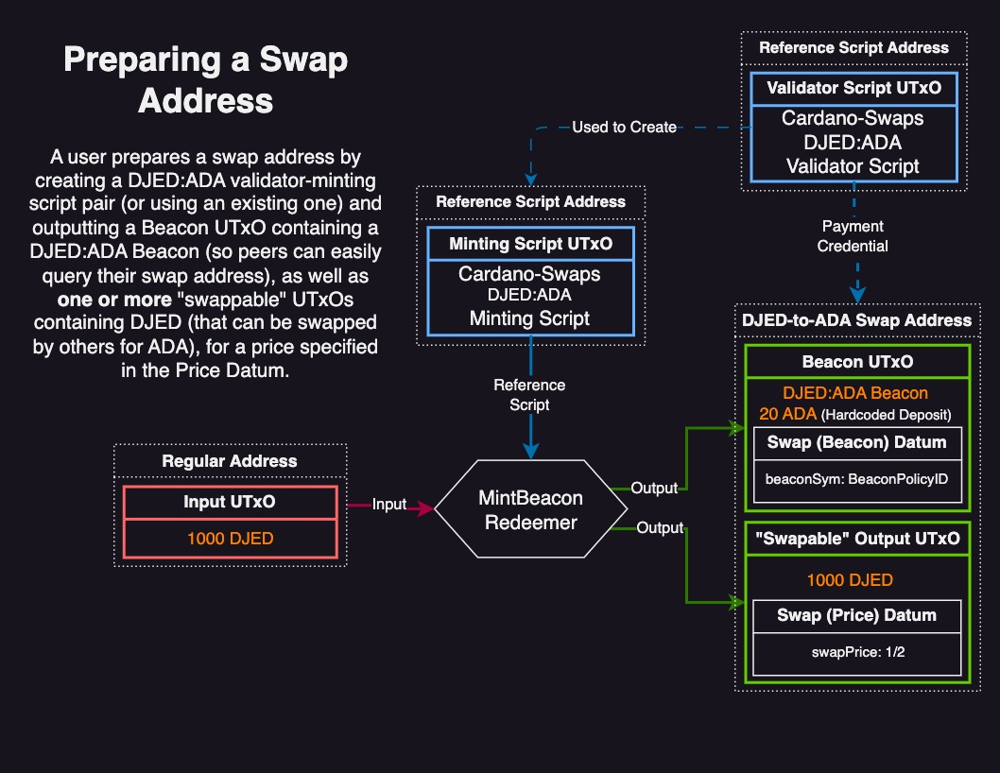
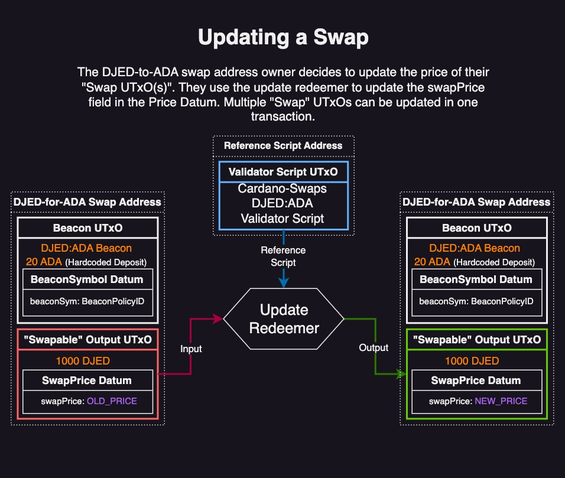
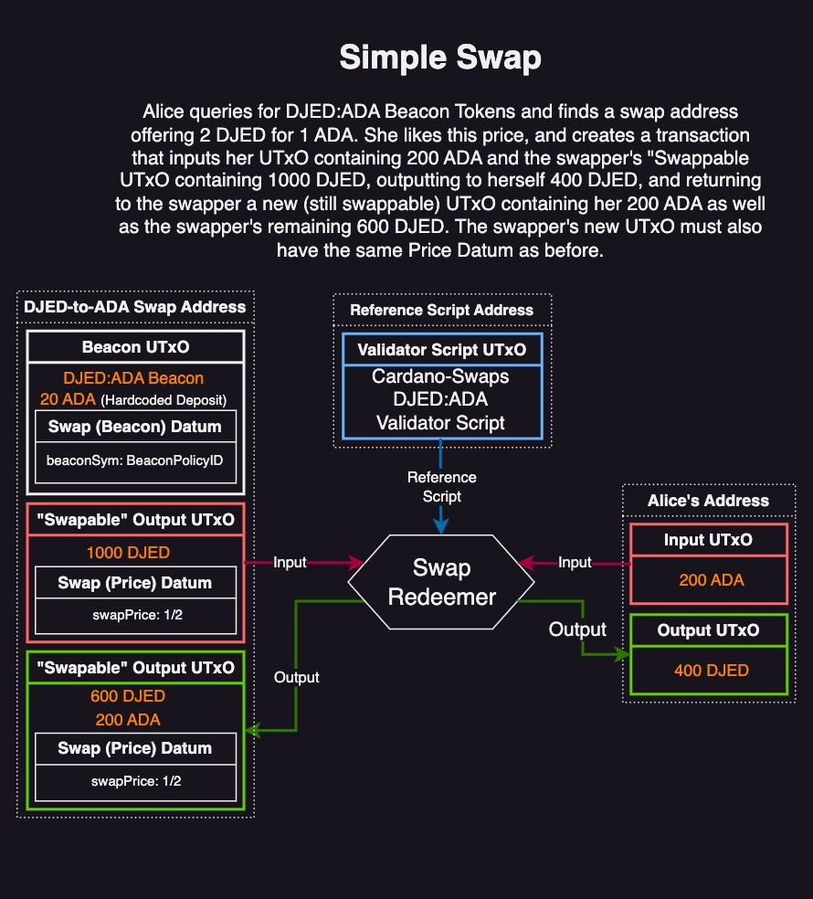
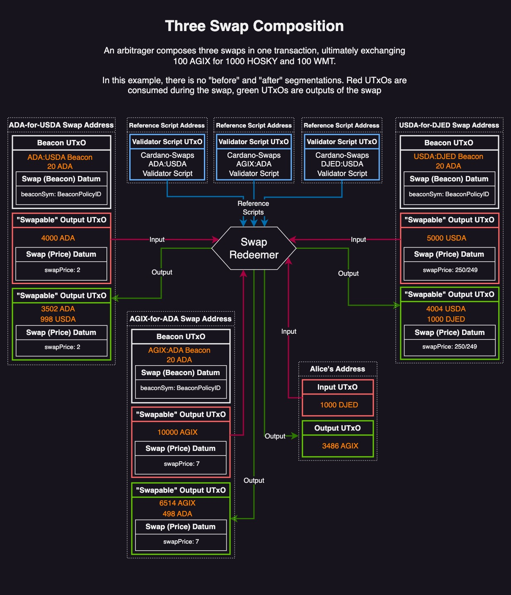

# Cardano-Swaps
A [p2p-DeFi protocol](https://github.com/zhekson1/CSL-DeFi-Protocols) for swapping fungible tokens on the Cardano Settlement Layer

> **Note**
> Knowledge of basic Haskell syntax and cardano-cli usage is recommended. For a list of everything that has changed from the previous version, see the [Changelog](CHANGELOG.md).

The Getting Started instructions can be found [here](./GettingStarted.md).

---
## Table of Contents 
- [Abstract](#abstract)
- [Motivation](#motivation)
- [Preliminary Discussion](#preliminary-discussion)
- [Specification](#specification)
- [Features Discussion](#features-discussion)
- [Future Directions](#future-directions)
- [FAQ](#faq)
- [Conclusion](#conclusion)

## Abstract
Cardano-swaps is a p2p-DeFi protocol for swapping fungible tokens on the Cardano Settlement Layer (CSL). It solves many of the pitfalls of current DEX implementations by empowering users to deploy their own (and interact with each others') script addresses. This leads to the formation of an order-book style "virtual" DEX, where liquidity arises from the aggregate of composable p2p swaps. 

## Motivation
Many DEXes on Cardano are currently implemented in ways that lock users' assets into a tightly fixed, and/or centrally maintained, set(s) of script addresses. Such design patterns are reminiscent of the EVM's accounts-based programming paradigm, and inherit many of the same downsides; scalability bottlenecks and asset/stake centralization. DEXes that hope to achieve massive scale on the CSL must adhere to a radically different approach that takes full advantage of the composability and availability guarantees offered by the eUTxO model.

## Preliminary Discussion
To appreciate the necessity of new DEX standards, it first important to understand the deficiencies of the current status-quo:

### Current DEX Deficiencies  
One consequence of centralized script addresses is the necessity for liquidity pools and LP providers as discrete, permissioned entities. LPs are a common feature of many DEXes, coming with undesirable properties and corresponding sets of workaround "solutions". However, these workarounds have issues themselves, as explored here:


| Undesirable Property | Workaround "Solution" | Issues |
| :--: | :--: | :--: |
| Impermanent Loss | Yield Farming & Concentrated Liquidity | Medium - Long term unsustainability |
| Incomplete or No Delegation Control | <ul><li>Asset pool fractionalization</li><li>Indirect Delegation via Governance Tokens</li></ul> | <ul><li>Unfair distribution of Governance tokens </li><li>Unavoidable centralization of stake (Major issue for Ouroboros)</li></ul>
| Scaling Bottlenecks | Batchers, Execution/Routing Engines, and/or other middlemen | Middlemen can take advantage of their position between users and the protocol. Even if MEV is mitigated, more users --> more execution demand --> possible centralization of middlemen if the batchers are not permissionless |

Of course, this is not an exhaustive list, and even if some workarounds can be somewhat effective, the underlying design *principles* are suboptimal.

Additionally, current implementations of order-book style DEXes (which don't use LPs) still suffer from the scalability challenges of permissioned batchers. No matter how performant a system of batchers is, their resources do **not** scale in proportion to the number of users unless new batchers can permissionlessly join when there is high demand. Cardano-Swaps achieves batcher/router-free scalability *with* delegation control.

### Programmable Swaps
First proposed by Axo in their original [whitepaper](https://www.axo.trade/whitepaper.pdf), programmable swaps are a more promising design choice than liquidity pools. Swaps are simply UTxOs that may be consumed if and only if the resulting TX outputs satisfy the input script's logic. Swaps can be fragmented across many user-controlled addresses, so delegation control is maintained. Users then execute swaps from each other's addresses. Since each swap is atomic and explicitly defined, in aggregate they are the optimal expression of (intra)market sentiment. This design pattern scales naturally, since there must be at *least* as many swap addresses as there are users. 

### The Cardano-Swaps Protocol
Cardano-Swaps takes inspiration from Axo's programmable swaps design, adds delegation control as a foundational feature, and, through the use of Beacon Tokens, removes the need for specialized indexers. The only remaining bottleneck is the querying capacity of existing off-chain APIs, such as Blockfrost or Koios. (This is not a limitation for users with powerful enough hardware, as they can run their own API database).

The Cardano-Swaps Protocol is broadly comprised of two steps:

1. **Prepare Swap Address** - Alice prepares a swap address for swapping Token "ABC" for Token "XYZ" by minting an ABC:XYZ Beacon Token in a "Beacon UTxO" that designates her address specifically as an ABC-to-XYZ swap address. She then (in the same or separate transaction) outputs one or more "Swap UTxO(s)" with "ABC" Tokens, with an attached `Price` Datum that designates her desired price (in "XYZ") for that particular UTxO.
   
2. **Fulfill Swap(s)** - Bob queries a list of ABC-to-XYZ swap addresses (via the ABC:XYZ Beacon Token), and finds some attractively priced UTxOs in Alice's swap address. He submits a transaction that consumes one (or multiple) of Alice's "Swap UTxO(s)", and one or more of his own UTxO(s) containing Alice's requested "XYZ" Token. Bob can then output Alice's "ABC" Tokens to himself in proportion to the amount of "XYZ" tokens he outputs back to Alice. Bob does not have to buy all of the contents of one of Alice's UTxOs - he buy however much he wants, and output the remaining "ABC" back to Alice in the same UTxO as her "XYZ" payment. This UTxO (containing Alice's "XYZ" tokens) remains swappable as long as some "ABC" tokens remain in it; nobody except Alice can claim the "XYZ" tokens.

These features are further explained in the [Discussion section](<#Discussion & FAQ>) below

**This Aiken version of Cardano-Swaps can handle up to 14 swaps in a single transaction with a fee of only 1.5 ADA. A transaction with a single swap only costs 0.25 ADA. This makes Cardano-Swaps up to an order of magnitude cheaper than existing Cardano DEXs.** See [benchmarks](Benchmarks.md) for details.


## Specification

### Minting and Using Beacon Tokens
Beacon Tokens are used to tag `cardano-swaps` addresses so they are readily queryable via an off-chain API, such as Koios or Blockfrost. It is relatively straightforward to find all addresses that contain a specific native token. Here are some examples:

| Task | Koios Api | Blockfrost Api |
|--|--|--|
| Addresses with a beacon | [api](https://api.koios.rest/#get-/asset_address_list) | [api](https://docs.blockfrost.io/#tag/Cardano-Assets/paths/~1assets~1%7Basset%7D~1addresses/get)|
| UTxOs at the address | [api](https://api.koios.rest/#post-/address_info) | [api](https://docs.blockfrost.io/#tag/Cardano-Addresses/paths/~1addresses~1%7Baddress%7D~1utxos/get)|

Technically, all native tokens can be used as beacons like this but this feature is usually not the intended one. The name *Beacon Token* refers to any native token whose purpose is to act as a tag/beacon. See [here](https://github.com/zhekson1/CSL-DeFi-Protocols#common-design-patterns) for more information on Beacon Tokens.

#### Beacon Tokens with Cardano-Swaps
Every trading pair gets its own spending script. This is accomplished with the help of the `SwapConfig` parameter:

``` Haskell
data SwapConfig = SwapConfig
  { swapOffer :: (CurrencySymbol,TokenName)
  , swapAsk :: (CurrencySymbol,TokenName)
  }
```

**Each combination of `swapOffer` and `swapAsk` results in a different spending script. All spending scripts are identical except for this extra parameter. The hash of the resulting spending script is used as an extra parameter to the beacon minting policy. *All beacon minting policies are identical except for this extra parameter.* As a result, every `SwapConfig` will also have its own unique beacon policy.**

Since the Beacon policyID itself carries all the information needed to determine which trading pair is being used, every Beacon has an empty token name - this is enforced by the minting policy.

#### Minting Requirements
Minting beacons for `cardano-swaps` is a tightly controlled process. In order to mint beacons, **all of the following must be true**:

1. Only one beacon is minted per Tx.
2. The minted beacon uses an empty token name.
3. The beacon is minted to an address protected by the `cardano-swaps` spending script for a particular trading pair.
4. The beacon is minted to an address with a staking credential (either a pubkey or a script).
5. The datum of the output containing the beacon must have the proper `beaconSymbol` field.
6. The beacon must be stored with a minimum of 20 ADA.

Once the beacon is minted to the swap address, the spending script does not allow consuming the beacon's UTxO *unless* the beacon is being burned. This is done to prevent beacons from being sent to unrelated addresses.

> **Note**
> 20 ADA is used as a hardcoded deposit for "Beacon UTxOs" to prevent malicious users from spamming other users' querying capacities for a particular trading pair. This deposit can be reclaimed when closing the address.

#### Burning Requirements
Since minting and spending beacons are so heavily controlled, there is no reason to regulate burning. Burning is always allowed as long as the burn redeemer is only used to burn beacons.

#### Querying the Beacon Tokens
Below is an example response from querying the beacon tokens:
``` JSON
[
  {
    "assets": [
      {
        "asset": "lovelace",
        "quantity": 15000000
      },
      {
        "asset": "c0f8644a01a6bf5db02f4afe30d604975e63dd274f1098a1738e561d.4f74686572546f6b656e0a",
        "quantity": 5
      }
    ],
    "datum": {
      "price": {
        "denominator": 600000,
        "numerator": 1
      }
    },
    "swap_address": "addr_test1zqquvxk3d44kkry0a502f60vq6qkr8kq0f82h7vpttvrvmpualkqngnmdz2w9mv60zuucq0sswtn6lq2lwxwez76x0aqhzu5re",
    "utxo_id": "14779637d6b6d8631f2af0952c2e31a7f800ae4b12d1ca95e843bdbd0ffb4d7d#0"
  }
]
```

Only one UTxO was found, containing Lovelace (ADA) and 5 units of a native token. The asking price is one unit of the desired native token for 0.6 ADA. This response has everything a user needs to swap with the address.

#### Generalizing Beacon Tokens
While these beacons are used to "tag" all necessary information for engaging in swaps, they can be used for tagging ANY on-chain data w.r.t. to:

1. The address containing the Beacon
2. The UTxO containing the Beacon 
3. The information for any transaction(s) the Beacon has ever been in 

For example, it is possible to query the metadata of all transactions the Beacon was ever a part of. This can be used to create an easily queryable & trustless "metadata history" trail. Here are some examples:

| | Blockfrost | Koios |
| :--: | :--: | :--: |
| TX history | [api](https://docs.blockfrost.io/#tag/Cardano-Assets/paths/~1assets~1%7Basset%7D~1transactions/get) | [api](https://api.koios.rest/#get-/asset_txs) |
| TX metadata | [api](https://docs.blockfrost.io/#tag/Cardano-Transactions/paths/~1txs~1%7Bhash%7D~1metadata/get)| [api](https://api.koios.rest/#post-/tx_metadata) |

Beacon Tokens make all of this information readily queryable; no configuration of the tokens is necessary. This can be used in a wide variety of dApps - **the only requirement is that the beacon token is unique for each *kind* of datatype.**

---

### The DEX's Inline Datum
For users to see each others' asking prices, all datums for the DEX must be inline datums:

``` Haskell
-- | Swap Datum
type Price = Rational -- ^ askedAsset/offeredAsset
data SwapDatum
  = BeaconSymbol CurrencySymbol -- ^ Datum stored with beacons.
  | SwapPrice Price -- ^ Datum stored with swappable UTxOs.
```

> **Note** 
> This datum is different than the previous version of Cardano-Swaps, which used a product type.

#### SwapPrice
The `Rational` type is a fraction (decimal types do not work on-chain). Fortunately, there is no loss of functionality from using fractions.

All prices in Cardano-Swaps are relative (similar to limit orders in an order-book exchange). Swaps are always priced in askedAsset/offeredAsset. For example, if $ADA is being offered for $DUST at a price of 1.5 (converted to 3/2), the contract requires that 3 $DUST are deposited for every 2 $ADA removed from the swap address. Ratios of DUST:ADA >= 3/2 will pass, while ratios < 3/2 will pass. 

When engaging in swaps, it is only necessary that the desired swap ratio is met; **not all assets at the swap address or UTxO must be swapped.** For example, if there is 100 ADA in a swap address requesting 2:1 for DUST, a user may swap 20 ADA, as long as they return 80 ADA and 10 DUST in the same TX.

Since every user explicitly defines their desired swap ratios, oracles are not required. The "global" price naturally emerges where the local bids and asks meet - just like an order-book.

> **Warning**
> A zero or negative price means the assets are effectively free. A malicious user may deposit a UTxO with a negative price in the datum in order to steal user funds. To prevent this, swaps will fail unless all prices are greater than 0.

:heavy_exclamation_mark: In the previous version, users could have specified a price in units of ADA and the script would convert it to units of lovelace during execution. This feature was removed to save on execution costs. Now, all prices for ADA must be in units of lovelace.

#### BeaconSymbol
The `BeaconSymbol` datum prevents misuse of beacons. The contract forces all assets with the supplied policy-id to be burned instead of being withdrawn. This ensures the beacons can never be found in an address unrelated to `cardano-swaps`. **If the wrong policy id is supplied, assets can be locked forever.** Only the UTxO containing the beacon needs to use the `BeaconSymbol` datum; all active swaps use the `SwapPrice` datum. `cardano-swaps` CLI handles this part of the datum automatically, preventing accidental misuse.

Preparing a swap address:




---

### Swap Contract Logic
Swap contracts have three possible actions, a.k.a. redeemers:

1. `Close` - withdraw any UTxO located at the swap address and burn the beacon
2. `Update` - update the asking price for UTxOs at the swap address
3. `Swap` - executing a swap with assets at the swap address

Only the owner (signified by the address' staking credential) is allowed to use the `Close` or `Update` redeemers. Anyone can use the `Swap` redeemer.


#### `Close` Redeemer
The `Close` redeemer allows the owner (signified by the address' staking credential) to recover the deposit stored with the reference script, and make the address undiscoverable by burning the beacon. **In order to reclaim the deposit, the beacon must be burned.** The requirements for successfully using the `Close` redeemer are:

1. All beacons among Tx inputs must be burned.
2. The staking credential must signal approval:
    - pubkey must sign
    - script must be executed in the same tx


#### `Update` Redeemer
The `Update` redeemer allows the owner to change the asking price of their position(s) by changing the inline datum attached of associated UTxOs. This action includes checks to ensure the new datum is properly used. The requirements for a successful update are:

1. No beacons among tx inputs.
2. The staking credential must signal approval:
    - pubkey must sign
    - script must be executed in the same tx
3. All new outputs to the address must contain the proper datum:
    - It must be an inline `SwapPrice` datum with a price > 0.




#### `Swap` Redeemer
The `Swap` redeemer checks all of the assets leaving the swap address and all of the assets entering the swap address. For a successful swap, all of the following must be true:

1. No swap input utxos have a `BeaconSymbol` datum.
2. All swap input prices are > 0.
3. All outputs to the swap address contain the proper datum:
    - inline `SwapPrice` datum with the price == weighted avg price of all swap inputs
4. Only the offered asset (as defined in `SwapConfig`) is leaving the swap address.
5. QuantityOfferedAssetTaken * weighted average price <= quantityAskedAssetGiven



Custom error messages are included to help troubleshoot why a swap failed. The weighted average price must match exactly what the swap contract calculates. To help with this, `cardano-swaps` can calculate the weighted price for you.


## Features Discussion
Here are some of the most impactful features of Cardano-Swaps:

### Delegation Control
Since each user has their own swap address, the process of delegation is identical to that of a normal address (either by staking key or staking script). 

Check out the [delegation section](GettingStarted.md#delegate-the-swap-address) of [GettingStarted.md](GettingStarted.md) for an example using a staking pubkey.

### Composable Atomic Swaps
Since multiple swaps are combinable into a single transaction, any arbitrarily complex swap transaction can be created. The only limit is the size of the transaction itself.

Do you want to convert 10 ADA into 5 DUST and 5 AGIX? No problem! This can be done in one transaction.
What about converting 10 ADA, 5 DUST, and 3 WMT into 16 AGIX and 11 HOSKY? Piece of cake!



By composing these swaps in one transaction, many-to-many multi-asset swaps are possible. The only limits are the maximum transaction limits for Cardano.

### Emergent Liquidity
Liquidity in cardano-swaps is an *emergent* property; it arises from the (healthy) incentive for arbitragers to engage in complex swap transactions. Discrete liquidity pools are unnecessary.

#### The Contrived Example

``` Txt
Alice has 10 ADA in her swap address and is willing to swap them for 0.5 AGIX/ADA.
Bob has 10 AGIX in his swap address and is willing to swap them for 1 ADA/AGIX.
```

In this example, Charlie can profitably arbitrage and fulfill both of these swaps like this:

``` Txt
Charlie looks up all swap addresses willing to swap AGIX/ADA. Charlie finds Alice's address.
Charlie looks up all swap addresses willing to swap ADA/AGIX. Charlie finds Bob's address.
Using Bob's reference script, Charlie gives Bob 10 ADA and receives 10 AGIX.
Using Alice's reference script, Charlie gives Alice 5 AGIX and receives 10 ADA.
Charlie now has his original 10 ADA plus an additional 5 AGIX.
This all occurs in one transaction where Charlie pays the transaction fee.
```

On net, Charlie pays the transaction fees and receives 5 AGIX in return, while both Alice and Bob's swaps are fulfilled.

#### The Realistic Example

``` Txt
Alice has 10 ADA in her swap address and is willing to swap them for 1 DUST/ADA.
Bob has 10 DUST in his swap address and is willing to swap them for 0.5 AGIX/DUST.
Charlie has 10 AGIX in his swap address and is willing to swap them for 1 HOSKY/AGIX.
Mike has 10 HOSKY in his swap address and is willing to swap them for 1 ADA/HOSKY.
```

In this example, Sarah can profitably arbitrage and fulfill all of these swaps like this:

``` Txt
Sarah looks up all swap addresses willing to swap DUST/ADA. Sarah finds Alice's address.
Sarah looks up all swap addresses willing to swap AGIX/DUST. Sarah finds Bob's address.
Sarah looks up all swap addresses willing to swap HOSKY/AGIX. Sarah finds Charlie's address.
Sarah looks up all swap addresses willing to swap ADA/HOSKY. Sarah finds Mike's address.
Sarah gives Mike 10 ADA and receives 10 HOSKY.
Sarah gives Charlie 10 HOSKY and receives 10 AGIX.
Sarah gives Bob 5 AGIX and receives 10 DUST.
Sarah gives Alice 10 DUST and receives 10 ADA.
Sarah now has her original 10 ADA plus an additional 5 AGIX.
This all occurs in one transaction where Sarah pays the transaction fee.
```

On net, Sarah pays the transaction fees and receives 5 AGIX in return, while four swaps are fulfilled.

#### Liquidity naturally flows to the less liquid pairs
As shown in the realistic example, Sarah fulfills *both* the AGIX/DUST swap and the HOSKY/AGIX swap by "passing through" those pairs on her way back to ADA. As long as the entry and exit pairs (in this case ADA/HOSKY and DUST/ADA) have enough liquidity, arbitragers can spread that liquidity into less liquid swap pairs.

As a bonus, **the very nature of *illiquidity* implies great arbitrage opportunities**. The more illiquid a swap pair, the greater the potential arbitrage profits. Participating in arbitrage is permissionless, so anyone can design their own algorithms for finding the most profitable "path" through the currently available swaps.

### Democratic Upgradability
Upgrades to `cardano-swaps` can propagate through the ecosystem of users in a similarly democratic fashion as SPOs upgrading their pools to a new version of `cardano-node`. Since users can close their swaps at any time, whenever there is a potential upgrade, users can choose to close their current swaps and recreate them with the new contracts. Bifurcation of liquidity that occurs during upgrade periods is not an issue because different versions of Cardano-Swaps can compose with each other. Therefore, there really isn't any bifurcation of liquidity during upgrade periods.

### Frontend Agnosticism
Thanks to the query-ability of beacon tokens, it is trivial for any frontend to integrate with Cardano-Swaps. For example, any wallet can integrate `cardano-swaps` by adding support for querying the beacon tokens. They can also add their own user friendly way to create and use swaps. The only requirement is that all frontends/users agree to use the same beacon token standard. There is no need for risky extensions or dedicated frontends.


## Benchmarks and Fee Estimations (YMMV)
Thanks to the efficiency of using Aiken, this version is capable of composing up to 14 different swaps in a single transaction with a total transaction fee is 1.5 ADA. A transaction with a single swap only costs 0.25 ADA. These results likely make this the cheapest DEX on Cardano by an order of magnitude.

Given the performance of these Aiken contracts, even though the redundant executions are still occuring, this DEX is more than performant enough for the current state of Cardano. **No CIPs or hard-forks are needed. This protocol works on the Cardano blockchain, as is.**

The full benchmarking details can be found [here](Benchmarks.md). The key take-away from the benchmarking is that using reference scripts is necessary for this DEX to reach its full potential. The original version had every user store a copy of the reference script with each beacon token. This was unnecessary and leads to redundant blockchain bloat due to the same script being stored on chain multiple times. Instead, this version assumes users and arbitragers will use their own reference scripts or trustlessly share scripts using Beacon Tokens as in [Cardano-Reference-Scripts](https://github.com/fallen-icarus/cardano-reference-scripts).


## Future Features Discussion

### Add beacons to improve indexing for arbitragers.

Currently, to lookup a swap, the only query possible is to lookup up a specific trading pair. But for arbitragers, it may be better to lookup all swaps where the offered asset is ADA. This would include AGIX/ADA, WMT/ADA, etc. This query can be achieved by introducing an additional beacon to the protocol.

## FAQ

#### Why is there a deposit for the Beacon UTxO?

The reason is to incentivize users to actually use the DEX as intended. If there were no deposits, users can create a live address with a beacon token and then just leave it open even if they aren't actually using the address anymore (like if there are no swappable assets in it). This "zombie" address will still appear when querying the beacon tokens even though other users can't actually do anything with it. By requiring the deposits, users are incentivized to close unused addresses in order to get the deposits back.

#### If all users share a spending script, how are their assets protected?
The spending script gets the staking credential from the address of the UTxO being spent at run-time. When an owner related action is being performed (closing or updating positions), the spending script requires that the staking credential "signals approval" of the action:

- If the staking credential is a pubkey, then the staking pubkey must sign the transaction.
- If the staking credential is a script, then the script must be executed in the same transaction.
- the staking credential effectively *becomes* the "owner" for all actions except for the actual swap execution, in which case the spending credential is used directly.

 It is possible to execute a staking script even if 0 ADA is withdrawn from a reward address. The only requirement to use staking scripts like this is that the associated stake address must be registered and delegated. Stake addresses can be utilized this way as soon as the registration+delegation transaction is added to the chain. There is no epoch waiting-period.

#### Why not just give each user their own spending script?
`cardano-swaps` relies on the usage of [beacon tokens](<#specification/##Beacon Tokens>) to "tag" addresses, which demarcates them as *distinct* for efficient off-chain querying/aggregation. However, **address distinction is impossible if each script address is composed of completely unique credentials.** In other words, for Beacon Tokens to work properly, there must be a clear distinction between addresses participating in a given dApp and all other addresses. `cardano-swaps` leverages the dual payment-staking credentials of Cardano addresses to maintain address-distinction (shared spending scripts) without sacrificing self-custody (unique staking keys/scripts). For further clarification, refer to the [Beacon Token CIP](https://github.com/cardano-foundation/CIPs/pull/466)

:pushpin: v1.0.0 of cardano-swaps used unique spending scripts; you can read about the limitations in the v1.0.0 commit README.

#### What if two arbitragers compete for the same swap?
Recall the contrived example above. What would happen if Charlie and Mike try to arbitrage it at the same time?

1. Charlie and Mike both build their transactions since the UTxOs still exist.
2. Charlie and Mike submit their transaction at the same time.
3. Charlie's is added to a block first.
4. When Mike's transaction is then picked to go into a block, the UTxOs no longer exist. The transaction fails without needing to run the swap contracts.

Since Mike's transaction will fail without needing to run the swap script, Mike's collateral is safe. Further, the more available swaps there are, the less likely these "collisions" will occur.

#### If Cardano-Swaps reaches mass adoption, won't TVL on Cardano go down?

Yes. Yes it will. TVL is a silly metric. It is a measure of who can be most inefficient with DeFi capital.

#### I have an idea for how to improve the protocol. Where should I go?

Feel free to use either the Issue section or the Discussion section on the Cardano-Swaps repo. Any feedback that can improve the protocol is welcome!

#### When Mainnet?

Currently, Aiken is still in the alpha phase and therefore, this protocol should also be considered in the alpha phase. Furthermore, there are some features that should be tried to determine their trade-offs. Mainnet release ideally should happen after:

1. Aiken stabilizes
2. Cardano-Swaps features stabilize
3. Cardano-Swaps undergoes a security audit

That being said, this protocol is fully peer-to-peer. If some community members are willing to accept the risks and are comfortable with the current features, nobody can stop them from using this protocol right now. 

## Conclusion
The cardano-swaps protocol has all of the desired properties of a highly scalable DEX. Thanks to the use of beacon tokens, decentralization is no longer limited by the design of DEXs. Instead, the limiting factor is now the off-chain querying. However, innovations in this space are still in the early days. The Koios API is an example of a more decentralized off-chain platform. As the technology improves, the decentralization of this protocol will improve as well.